# 네트워크

### 네트워크 구조

###### 컴퓨터 네트워크
- 두대 이상 연결되어 있는 네트워크
- 컴퓨터 간 필요한 데이터를 서로 주고 받는다

###### 인터넷
- 전 세계의 네트워크를 연결하는 거대한 네트워크

###### 패킷
- 컴퓨터 간 데이터를 주고 받을 때 네트워크를 통해 전송되는 데이터의 작은 조각
- 네트워크의 대역폭차지를 줄이기 위해 사용
- 큰 데이터는 작은 패킷으로 분할 해 전송한다

### 정보의 양을 나타내는 단위

###### 비트 (Bit)
- 0 과 1의 정보를 나타내는 최소 단위

###### 바이트 (Byte)
- 0 또는 1인 숫자 8개를 모아 표시하는 단위

###### 아스키 코드 (ASCII CODE)
- 알파벳, 기호, 숫자 등을 다룰 수 있는 기본적인 문자 코드

### 랜과 왠

###### 랜 (Local Area Network)
- 특정 지역을 범위로 하는 네트워크

###### 왠 (Wide Area Network)
- 지리적으로 넓은 범위에 구축된 네트워크

###### 랜과 왠의 차이

|     | 랜               | 왠             |
|-----|-----------------|---------------|
| 범위  | 좁다 (건물이나 특정 지역) | 넓다 (랜과 랜을 연결) |
| 속도  | 빠르다             | 느리다           |
| 오류  | 적다              | 많다            |

### 가정에서하는 랜 구성

###### 가정에서의 네트워크 구성

###### 접속 방식
- 유선 랜 : `랜 케이블`이 필요하다   
- 무선 랜 : `랜 케이블`이 필요없다

### 회사에서 하는 랜 구성
.png)
.png)

##### 회사에서 서버를 운영하는 방식

###### 온프레미스
- 사내 또는 데이터센터에 서버를 두고 운영하는 방식

###### 클라우드 서비스
- 인터넷을 통해 소프트웨어나 하드웨어등의 컴퓨팅 시스템을 제공하는 서비스

### 네트워크 규칙

###### 프로토콜
- 통신하기 위한 규칙
- 문제 없이 통신을 하기 위해 필요하다

### OSI 모델, TCP/IP 모델

###### OSI 모델
- ISO 라는 단체에서 OSI 모델이라는 표준규격을 제정했다
- 네트워크 기술의 기본이 되는 모델
- 7개의 계층을 통해 여러가지 일을 한다

| 계층  | 이름       | 설명                       |
|-----|----------|--------------------------|
| 7계층 | 응용 계층    | 애플리케이션에 대한 서비스를 제공한다     |
| 6계층 | 표현 계층    | 데이터를 변환한다                |
| 5계층 | 세션 계층    | 세션체결, 통신 방식을 결정한다        |
| 4계층 | 전송 계층    | 신뢰할 수 있는 통신을 구현한다        |
| 3계층 | 네트워크 계층  | 통신을 위한 경로설정 및 논리주소를 결정한다 |
| 2계층 | 데이터링크 계층 | 데이터 전송 및 물리주소를 결정한다      |
| 1계층 | 물리 계층    | 물리적 연결과 전기신호를 변환 및 제어한다  |

###### 송수신 방법

####### TCP/IP 모델
- 총 4개의 계층으로 이루어져있다

| 계층  | 이름         |
|-----|------------|
| 4계층 | 응용 계층      |
| 3계층 | 전송 계층      |
| 2계층 | 인터넷 계층     |
| 1계층 | 네트워크 접속 계층 |

### 캡슐화와 역캡슐화

###### 캡슐화
- 헤더를 붙여 나가는 과정

###### 역캡슐화
- 헤더를 제거하는 과정

- 매 계층 마다 헤더를 만들어진 데이터에 붙인다
- 데이터링크 계층에서는 헤더와 트레일러를 붙인다

###### VPN
- Virtual Private Network(가상사설망)

### 물리계층의 역할과 랜카드의 구조

###### 전기신호
- 아날로그신호 : 물결모양 전기신호
- 디지털신호 : 막대모양 전기신호

###### 랜카드
- 네트워크를 통해 데이터를 송수신할 수 있도록 도와줌
- 0과 1의 정보가 컴퓨터 내부에 있는 랜 카드로 전송되고 랜카드는 0과 1을 전기신호로 변환한다

### 케이블의 종류와 구조

###### 트위스트 페어 케이블
- UTP 케이블과 STP 케이블이 있다
- 랜 케이블이라고 불린다
- 랜 케이블 양쪽 끝에는 RJ - 45라고 부르는 커넥터가 있다

###### UTP 케이블
- 실드로 보호되어 있지 않은 케이블
- 노이즈 영향을 받기 쉽지만 저렴하여 일반적으로 많이 사용한다

###### STP 케이블
- 실드로 보호한 케이블
- 노이즈 영향을 매우 적게 받지만 비싸서 보편적으로 사용하지는 않는다

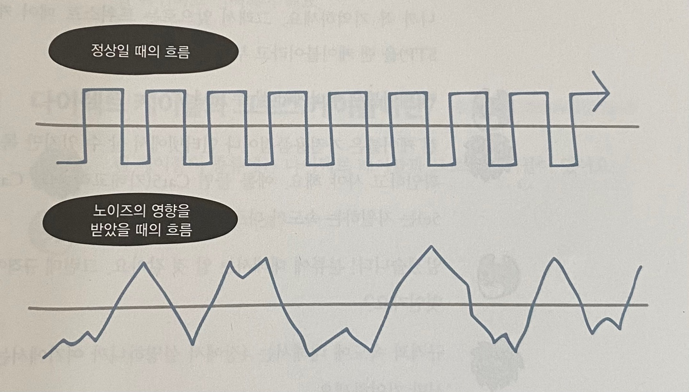

###### UTP 케이블의 분류
| 분류    | 규격            | 속도       |
|-------|---------------|----------|
| Cat3  | 10BASE - T    | 10Mbps   |
| Cat5  | 100BASE - TX  | 100Mbps  |
| Cat5e | 1000BASE - T  | 1000Mbps |
| Cat6  | 1000BASE - TX | 1000Mbps |
| Cat6a | 10GBASE - T   | 10GMbps  |
| Cat7  | 10GBASE - TX  | 10GMbps  |

###### 다이렉트 케이블
- 선 8개 같은 순서로 커넥터에 연결한 케이블이다

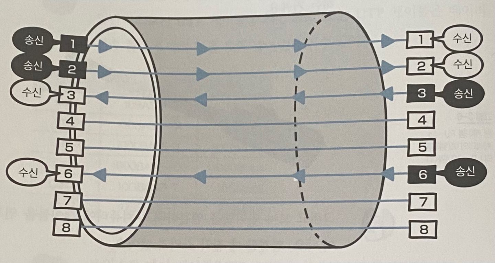

###### 크로스 케이블
- 1, 2번에 연결되는 선을 다른 쪽 커넥터 3, 6번에 연결한 케이블이다

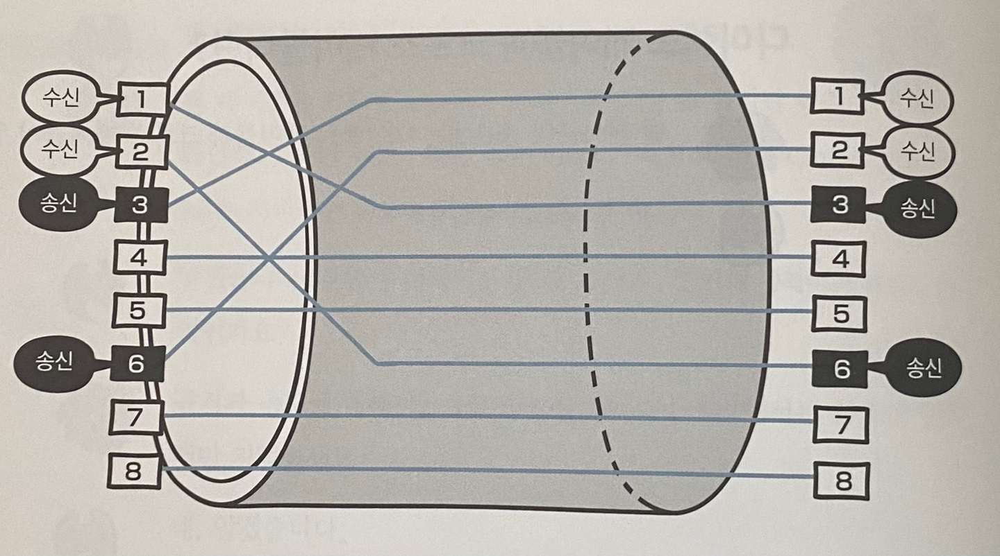

### 리피터와 허브의 구조

###### 리피터
- 전기신호를 정형하고 증폭하는 기능을 가진 네트워크 중계장비

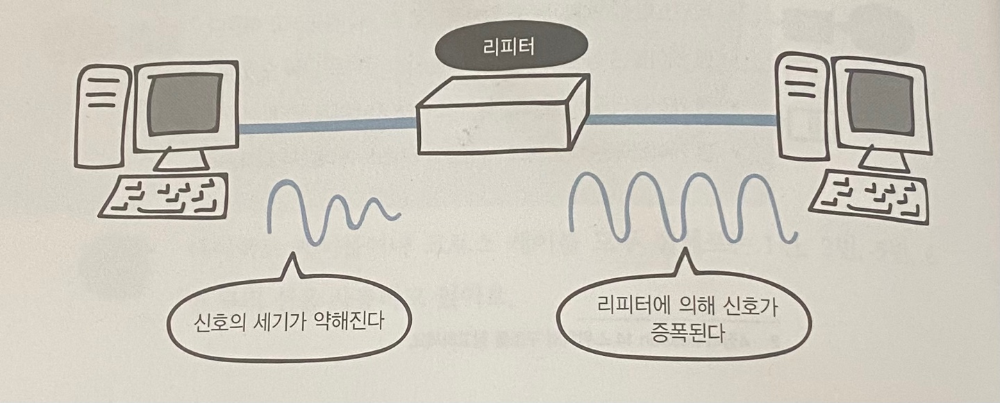

###### 허브
- 포트를 이용하여 여러개의 컴퓨터와 통신을 할 수 있다
- 전기신호를 정형하고 증폭하는 기능을 한다
- 더미허브 : 스스로 판단하지 않고 전기 신호를 모든 포트로 보낸다

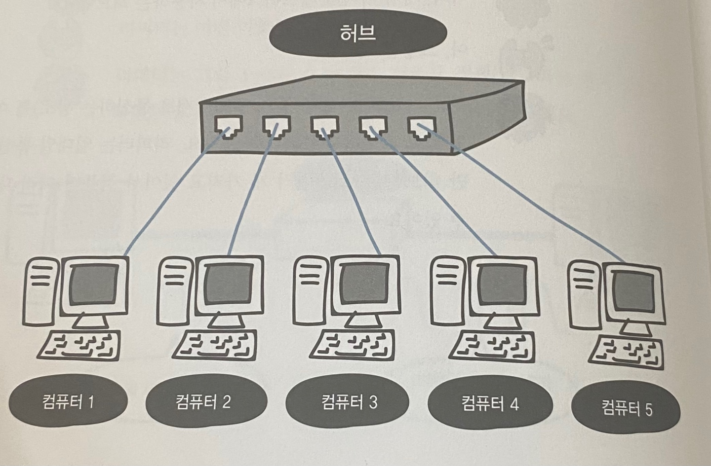

### 데이터링크 계층의 역할과 이더넷

###### 이더넷
- 랜에서 데이터를 정상적으로 주고 받는 규칙 중 일반적으로 가장 많이 사용되는 규칙
- 랜에서 적용되는 규칙

###### CSMA / CD
- 컴퓨터가 여러대가 동시에 데이터를 보내면 데이터들이 서로 부딪혀 충돌이 일어나는 것을 막기 위한 방법
- `CS`는 데이터를 보낼려고 하는 컴퓨터가 케이블에 신호가 흐르고 있는지 아닌지를 확인하는 규칙이다
- `MA`는 케이블에 데이터가 흐르고 있지 않다면 데이터를 보내도 좋다 라는 규칙이다
- `CD`는 충돌이 발생하고 있는지를 확인한다 라는 규칙이다

### MAC 주소의 구조

###### MAC 주소
- 물리주소, 전세계에서 유일한 번호
- 48비트 숫자로 구성되어 있다
- 이더넷 헤더와 트레일러를 붙여 통신
- 이더넷 허데와 트레일러가 추가된 데이터를 `프레임`이라고 한다

`00 - 23 - AE - D9 - 7A - 9A`   

`목적지 주소(6Byte)` `출발지 주소(6Byte)` `유형(2Byte)`

###### 프로토콜을 식별하는 번호(유형)
| 유형 번호 | 프로토콜               |
|-------|--------------------|
| 0800  | IPv4               |
| 0806  | ARP                |
| 8035  | RARP               |
| 814C  | SNMP over Ethernet |
| 86DD  | IPv6               |

###### FCS
- 데이터 뒤쪽에 추가하는 트레일러
- 데이터 전송도중 오류가 발생하는지 확인하는 용도로 사용한다

### 스위치의 구조

###### 스위치
- 데이터링크 계층에서 동작한다
- 레이어 2 스위치 또는 스위칭 허브라고도 불린다

###### MAC 주소 테이블
- 스위치의 포트번호와 해당 포트에 연결되어 있는 컴퓨터의 MAC 주소가 등록되는 데이터베이스이다
- MAC 주소 학습기능 : 출발지 MAC 주소가 등록되어 있지 않으면 MAC 주소를 포트와 함께 등록한다
- 플러딩 : 수신포트 이외의 모든 포트에서 데이터를 송신하는 것
- MAC 주소 필터링 : MAC 주소를 기준으로 목적지를 선택하는 것

### 이더넷의 종류와 특징

###### 이더넷 규격
| 규격 이름        | 통신 속도    | 케이블               | 최대 길이 | 표준화년도 |
|--------------|----------|-------------------|-------|-------|
| 10BASE5      | 10Mbps   | 동축 케이블            | 500M  | 1982년 |
| 10BASE2      | 10Mbps   | 동축 케이블            | 185M  | 1988년 |
| 10BASE - T   | 10Mbps   | UTP 케이블(Cat3 이상)  | 100M  | 1990년 |
| 100BASE - TX | 100Mbps  | UTP 케이블(Cat5 이상)  | 100M  | 1995년 |
| 100BASE - T  | 1000Mbps | UTP 케이블(Cat5 이상)  | 100M  | 1999년 |
| 10GBASE - T  | 10GMbps  | UTP 케이블(Cat6a 이상) | 100M  | 2006년 |

### 네트워크 계층의 역할

###### 라우터
- 다른 네트워크로 데이터를 전송하기위한 장비
- 데이터의 목적지가 정해지면 해당 목적지까지 어떤 경로로 가는 것이 좋은지를 알려준다
- 라우팅 : 목적지 IP 주소까지 어떤 경로로 데이터를 보낼지 결정하는 것
- 라우팅 테이블 : 경로 정보를 등록하고 관리

###### IP 주소
- 어떤 네트워크의 어떤 컴퓨터인지를 구분할 수 있도록 하는 주소

### IP란?

- IP 패킷 : 데이터에 IP 헤더가 추가되어 만들어지는 것

### IP 주소의 구조
- IP 주소는 ISP(인터넷 서비스 제공자)에게 받는다
- IP 주소는 32비트로 구분하기 쉽도록 10진수로 표시한다

|       | IPv4                         | IPv6         |
|-------|------------------------------|--------------|
| 주소 길이 | 32비트                         | 128비트        |
| 주소 유형 | fe80::3854:9d97:c368:c246%16 | 10.80.162.73 |
| 주소 개수 | 약 43억개                       | 약 340간       |

|       | 공인 IP                                   | 사설 IP                        |
|-------|-----------------------------------------|------------------------------|
| 설명    | 인터넷 사용자의 로컬 네트워크를 식별하기 위해 ISP 가 제공하는 주소 | 일반 가정이나 회사 내 등에 할당된 네트워크의 주소 |
| 할당 주체 | ISP(인터넷 서비스 제공자)                        | 라우터(공유기)                     |
| 할당 대상 | 개인 또는 회사의 서버(라우터)                       | 개인 또는 회사의 기기                 |
| 고유성   | 인터넷 상에서 유일한 주소                          | 하나의 네트워크 안에서 유일              |
| 공개 여부 | 내/외부 접근 가능                              | 외부 접근 불가능                    |

###### 네트워크 ID
- '어떤 네트워크' 인지를 나타낸다

###### 호스트 ID
- '해당 네트워크의 어느 컴퓨터' 인지를 나타낸다

### IP 주소의 클래스 구조

###### IP 주소 클래스
- 일반적으로 A ~ C 클래스까지 사용한다

| 클래스 이름 | 내용           | 최대 호스트 수    | 공인 IP 주소의 범위                                                  | 사설 IP 주소의 범위                                    |
|--------|--------------|-------------|---------------------------------------------------------------|-------------------------------------------------|
| A 클래스  | 대규모 네트워크 주소  | 1677만 7214대 | 1.0.0.0 ~ 9.255.255.255 / 11.0.0.0 ~ 126.255.255.255          | 10.0.0.0 ~ 10.255.255.255                       |
| B 클래스  | 중형 네트워크 주소   | 6만 5534대    | 128.0.0.0 ~ 172.15.255.255 / 172.32.0.0 ~ 191.255.255.255     | 172.16.0.0 ~ 172.31.255.255                     |
| C 클래스  | 소규모 네트워크 주소  | 254대        | 192.0.0.0 ~ 192.167.255.255 / 192.169.0.0 ~ 233.255.255.255   | 192.168.0.0 ~ 192.168.255.255                   |
| D 클래스  | 멀티캐스트 주소     |
| E 클래스  | 연구 및 특수용도 주소 |

### 네트워크 주소와 브로드캐스트 주소의 구조

###### 네트워크 주소
- 호스트 ID가 10진수로 0이고, 2진수로 00000000인 주소이다
- 호스트 ID가 10진수고 첫번째 숫자가 0인 주소이다
- 전체 네트워크에서 작은 네트워크를 식별하는데 사용된다

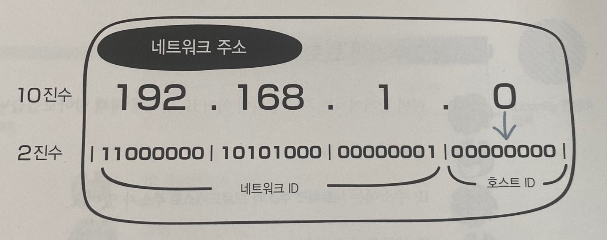

###### 브로드캐스트 주소
- 호스트 ID가 10진수로 255이고, 2진수로 11111111인 주소이다
- 호스트 ID가 10진수고 마지막 숫자가 255인 주소이다
- 네트워크에 있는 컴퓨터나 장비 모두에게 한번에 데이터를 전송하는데 사용하는 전용 IP 주소이다

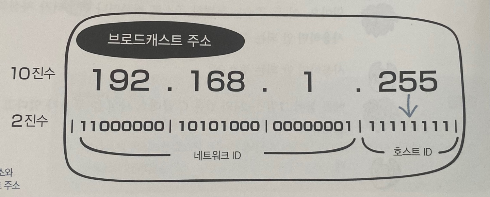

### 서브넷의 구조

###### 서브넷팅
- 네트워크를 분할하는 것

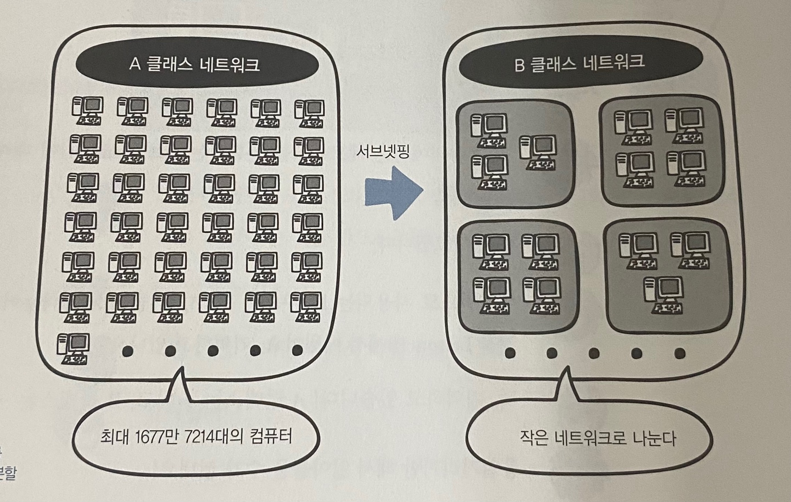

- 분할된 네트워크를 `서브넷` 이라고 한다
- 기존에 `네트워크 ID + 호스트 ID`로 구성되어 있던 것이 `네트워크 ID + 서브넷 ID + 호스트 ID`로 나누어진다

###### 서브넷 마스크
- `네트워크 ID`와 `호스트 ID`를 식별하기 위한 값

| 클래스 이름 | 서브넷 마스크       |
|--------|---------------|
| A 클래스  | 255.0.0.0     |
| B 클래스  | 255.255.0.0   |
| C 클래스  | 255.255.255.0 |

###### 프리픽스 표기법
- 서브넷 마스크를 `슬래시(/비트수)`로 표기한 것

### 라우터의 구조

###### 라우터
- 라우터가 있으면 네트워크를 분할할 수 있다

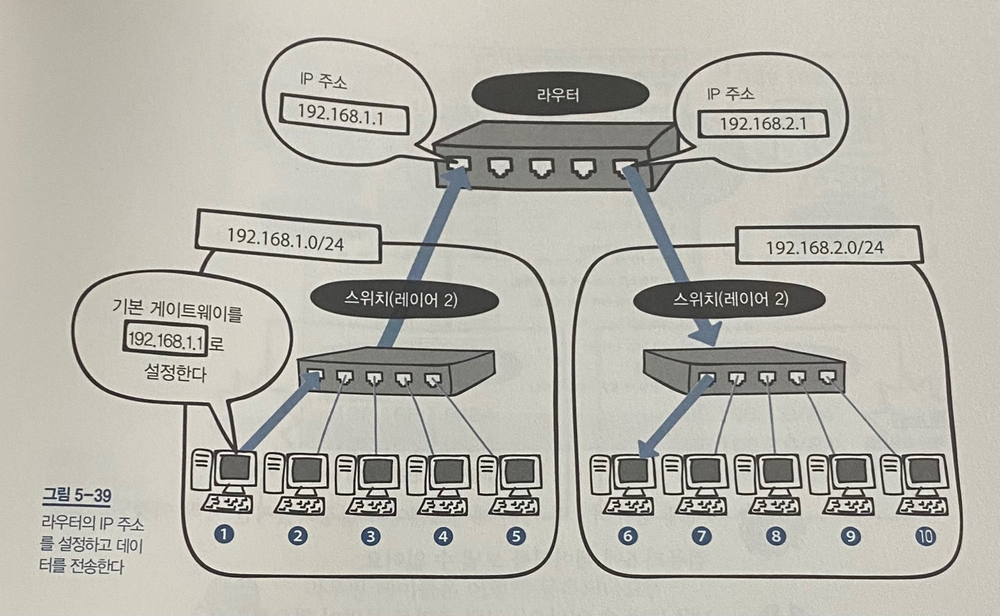

- 기본 게이트웨이 : 네트워크의 출입구를 설정하는 것

###### 라우팅
- 현재의 네트워크에서 다른 네트워크로 최적의 경로를 통해 데이터를 전송하는 것
- 라우팅 테이블 : 경로 정보가 등록되어 있는 테이블
- 라우팅 프로토콜 : 라우터 간에 라우팅 정보를 교환하기 위한 프로토콜

### 전송 계층의 역할

###### 전송계층
- 목적지에 신뢰할 수 있는 데이터를 전달하기 위해 필요한 계층이다
- 오류를 점검하는 기능이 있다
- 오류가 발생하면 데이터를 재전송하도록 요청한다
- 전송된 데이터의 목적지가 어떤 애플리케이션인지 식별하는 기능이 있다

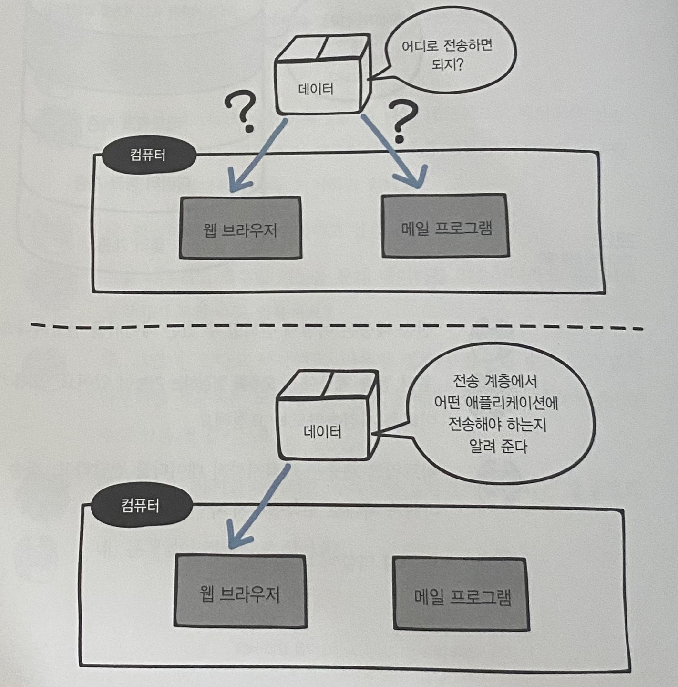

### 연결형 통신과 비연결형 통신

###### 연결형 통신
- 신뢰할 수 있고 정확한 데이터를 전달하는 통신
- TCP 프로토콜이 사용된다

###### 비연결형 통신
- 효율적으로 데이터를 전달하는 통신
- UDP 프로토콜이 사용된다

### TCP 의 구조

###### TCP
- 연결형 통신
- `TCP 헤더`를 붙여 전송하는데 헤더를 붙인 데이터를 `세그먼트`라고 한다

###### 연결
- TCP 통신에서 정보를 전달하기 위해 사용되는 가상의 통신로
- 연결을 하기 위해선 TCP 헤더에 있는 코드비트를 사용한다

코드비트

| URG | ACK | PSH | RST | SYN | FIN |
| --- | --- | --- | --- | --- | --- |

- `SYN` : 연결 요청
- `ACK` : 확인 응답
- `FIN` : 연결 종료

### 3-Way 핸드셰이크
- SYN 과 ACK 를 사용하여 연결을 확립한다
- 신뢰할 수 있는 연결을 하기위해선 데이터를 전송하기 전에 패킷을 교환하는데 총 세번 확인을 하는 것이다
- FIN 과 ACK 를 사용하여 연결을 종료한다

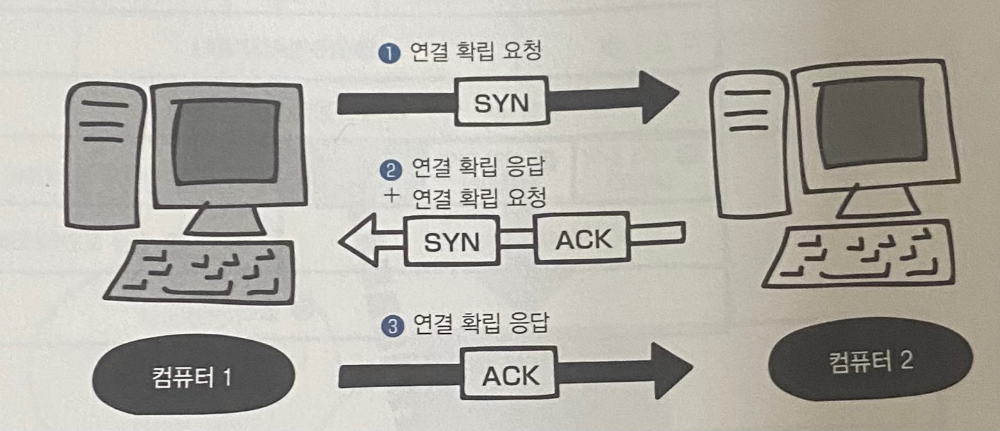
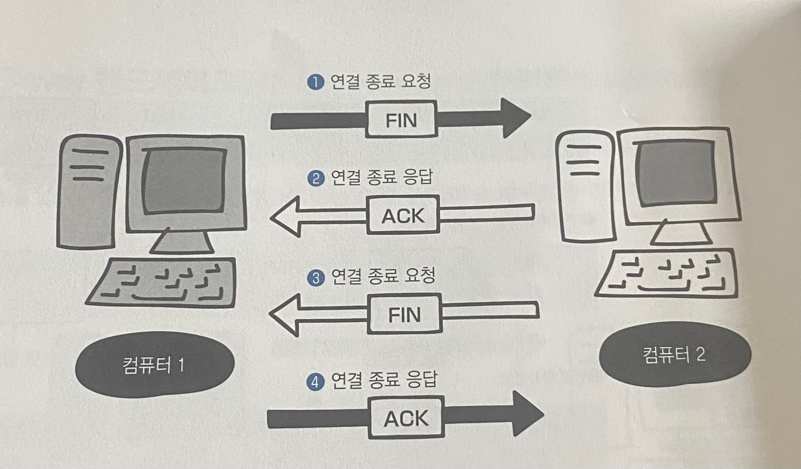

### 일련번호와 확인 응답 번호의 구조

###### 일련번호
- 송신 측에서 수신 측에 데이터가 몇번째 데이터인지 알려주는 역할

###### 확인 응답 번호
- 수신 측이 몇번째 데이터를 수신했는지 송신 측에 알려주는 역할

###### 재전송 제어
- 데이터가 손상되거나 유실된 경우에 데이터를 재전송하게 해주는 것

###### 버퍼
- 받은 세그먼트를 일시적으로 보관하는 장소

###### 오버플로
- 수신 측은 대량으로 데이터가 전송되면 보관하지 못하고 넘쳐버리는 현상

###### 윈도우 크기
- 오버플로가 발생하지 않도록 버퍼의 한계 크기를 알고 있는 곳
- 얼마나 많은 용량의 데이터를 저장해 둘 수 있는지를 나타낸다

### 포트 번호의 구조

###### 포트번호
- 애플리케이션을 구분할 수 있는 번호

| 포트 이름              | 포트 번호        | 설명                 |
|--------------------|--------------|--------------------|
| 잘 알려진 포트           | 0 ~ 1023번 포트 | 주요 프로토콜이 사용하도록 예약됨 |
| 예약되어있지만 사용하지 않는 포트 | 1024번 포트     | 예약이 되어 있지만 사용하지 않음 |
| 랜덤포트               | 1025번 포트 이상  | 클라이언트 측의 송신 포트로 사용 |

잘 알려진 포트

| 애플리케이션 | 포트 번호 |
|--------|-------|
| SSH    | 22    |
| SMTP   | 25    |
| DNS    | 53    |
| HTTP   | 80    |
| POP3   | 110   |
| HTTPS  | 443   |

### UDP 의 구조

###### UDP
- 비연결형 통신
- 데이터를 효율적으로 빠르게 보낸다
- `UDP 헤더`를 붙여 전송하는데 헤더를 붙인 데이터를 `UDP 데이터그램`이라고 한다

###### 브로드캐스트
- 랜에 있는 컴퓨터나 네트워크 장비에 데이터를 일괄로 보내는 것